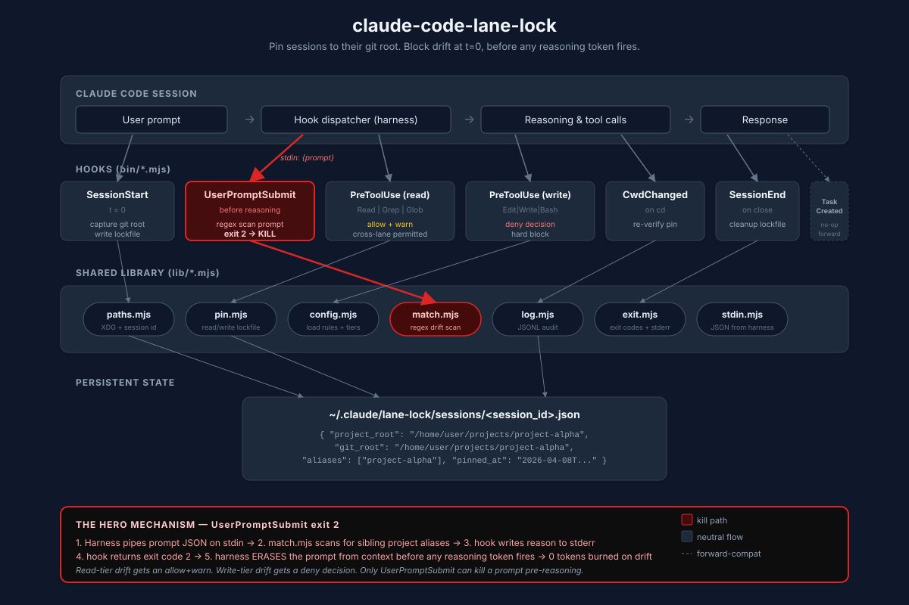

<div align="center">


# claude-code-lane-lock

**Pin Claude Code sessions to their git project root. Kill cross-project drift before the first reasoning token fires.**

[](https://github.com/maxysadm-GH/claude-code-lane-lock/actions/workflows/ci.yml)
[](#-quick-start)
[](https://github.com/anthropics/claude-code)
[](https://nodejs.org/)
[](package.json)
[](LICENSE)
[](docs/COMPAT.md)

<sub>
  <a href="#the-4-hour-drift">The incident</a> ·
  <a href="#-quick-start">Quick start</a> ·
  <a href="#how-it-works">How it works</a> ·
  <a href="#how-it-compares">Compare</a> ·
  <a href="#the-seven-hooks">Hooks</a> ·
  <a href="#configuration">Config</a> ·
  <a href="#faq">FAQ</a>
</sub>

<br/>


<!-- TODO(generate): 800x450 asciinema GIF. Scene: terminal split. Left pane inside ~/projects/project-alpha with a Claude Code session running. User types "now fix the project-beta dashboard". Right pane shows the lane-lock stderr panel rendering in red: "drift prompt BLOCKED before reasoning started". Final frame: `exit 2 · 0 reasoning tokens spent`. Target length: 12s loop. Theme: One Dark Pro. Font: JetBrains Mono 14px. -->

</div>

---

## The 4-hour drift

One overnight Claude Code session. Pinned to `~/projects/project-alpha`. Ambient instruction: *"keep working on the dashboard."*

Somewhere around 2am it drifted into `~/projects/project-gamma`. Read files from `project-gamma`. Planned for `project-gamma`. **Shipped 10 commits into the wrong repo.** Modified the production Easy Auth config on a live app. Updated two separate `CLAUDE.md` files.

The commits were technically fine. They actually improved the other project's dashboard. But I woke up to a foreign branch history in a repo I wasn't supposed to touch — and **4 hours of Opus tokens burned on the wrong project.**

The failure mode is simple: an ambiguous prompt sends a session that was pinned to project A straight into project B, because **Claude Code has no session-level understanding of which repo it belongs to.** Git worktrees solve this for branches inside one repo. They don't solve it across repos.

I read 12 swarm frameworks. I went through every open issue on `anthropics/claude-code` tagged `hook` or `session`. I checked Reddit, HN, r/ClaudeAI. Anthropic closed the "wrong repo" bug ([#13797](https://github.com/anthropics/claude-code/issues/13797)) as `NOT_PLANNED`.

Nobody shipped the fix. So I shipped it.

---

## ⚡ Quick start

```bash
git clone https://github.com/maxysadm-GH/claude-code-lane-lock ~/projects/claude-code-lane-lock
cd ~/your-project && node ~/projects/claude-code-lane-lock/bin/install.mjs
node ~/projects/claude-code-lane-lock/bin/lane-lock.mjs doctor
```

Verify it actually blocks:

```bash
node ~/projects/claude-code-lane-lock/bin/lane-lock.mjs simulate "fix the other project dashboard"
# → exit 2 + stderr block panel
```

Install user-wide instead with `--global`. Uninstall cleanly with `--uninstall`. The installer writes a timestamped backup before any change, is idempotent, and only removes its own entries — your existing hooks are preserved.

---

## How it works



<!-- TODO(generate): SVG architecture diagram. Left-to-right flow.
  (1) Claude Code hook event emits stdin JSON →
  (2) bin/<hook>.mjs (7 thin hook scripts, ~50 lines each) →
  (3) lib/ (paths.mjs, pin.mjs, config.mjs, match.mjs, log.mjs, exit.mjs, stdin.mjs) →
  (4) decision: stdout context injection · exit 0 allow · exit 2 block · permissionDecision deny →
  (5) ~/.claude/lane-lock/sessions/<session_id>.json lockfile + ~/.claude/lane-lock/logs/*.jsonl
  Highlight the UserPromptSubmit path in red as "kill path". Use a muted palette (slate/zinc/red accent). 1200x620. Include legend. -->

**The kill mechanism is one line of hook config and one exit code.** `UserPromptSubmit` fires the moment you hit Enter. If the prompt references a project that isn't the pinned one, the hook writes a block message to stderr and exits with code 2. Claude Code interprets exit 2 on `UserPromptSubmit` as *erase the prompt from context entirely* — the reasoning engine never sees it, never spends a token, never drafts a response to undo.

That's the trick. No LLM call. No round trip. No "are you sure?" dialog. The drift dies before it exists.

---

## How it compares

|                                              | **lane-lock** | git worktrees | Manual `CLAUDE.md` | Docker sandbox | ccswarm | claudekit |
|----------------------------------------------|:-------------:|:-------------:|:------------------:|:--------------:|:-------:|:---------:|
| Stops cross-**repo** drift                   |      ✅       |       ❌      |         ⚠️         |       ✅       |    ❌   |     ❌    |
| Stops cross-**branch** drift                 |      n/a      |       ✅      |         ❌         |       ✅       |    ✅   |     ❌    |
| Fires **before** any reasoning token         |      ✅       |      n/a      |         ❌         |      n/a       |    ❌   |     ❌    |
| Overrides `--dangerously-skip-permissions`   |      ✅       |      n/a      |         ❌         |       ✅       |    ❌   |    ⚠️    |
| Read-warn / write-block tiering              |      ✅       |       ❌      |         ❌         |       ❌       |    ❌   |    ⚠️    |
| Catches ambiguous prompts                    |      ✅       |       ❌      |         ❌         |       ❌       |    ❌   |     ❌    |
| Setup cost                                   |  one script   | `worktree add`|     rewrite md     | containerize   | full fw | full fw   |
| Runtime cost                                 |      $0       |       $0      |         $0         |   💰 per-box   |    $0   |     $0    |
| Zero runtime deps                            |      ✅       |       ✅      |         ✅         |       ❌       |    ❌   |     ❌    |

lane-lock isn't a replacement for worktrees or sandboxes — it's the layer above them that catches what they can't see: **the session-level identity of which repo a prompt belongs to.**

---

## Read-warn, write-block

> **The principle that makes lane-lock usable instead of abandoned.**
>
> A hard read-block would cripple real workflows. Sessions legitimately glance at sibling repos to copy a prompt pattern, a config shape, a dependency version. So lane-lock tiers the matcher:
>
> - **Reads** (`Read`, `Grep`, `Glob`) across project boundaries → **allowed with a warning injected into context.** The session can see the file, but the model is told explicitly that it's outside the pin.
> - **Writes** (`Edit`, `Write`, `MultiEdit`, `NotebookEdit`, `Bash`) outside the pin → **hard denied** via `permissionDecision: "deny"`. Even with `--dangerously-skip-permissions`.
>
> Tiering is the difference between a tool users install and a tool users uninstall after the first false positive.

---

## The seven hooks

| # | Hook                                            | When it fires                          | What it does                                                                                                                |
|---|-------------------------------------------------|----------------------------------------|-----------------------------------------------------------------------------------------------------------------------------|
| 1 | `SessionStart`                                  | t=0                                    | Captures git root via `git rev-parse --show-toplevel`, writes lockfile, injects a one-line lane marker into context         |
| 2 | **`UserPromptSubmit`**                          | **Before any reasoning token**         | **Exit 2 + stderr block panel on drift. Prompt erased from context entirely. This is the kill.**                            |
| 3 | `PreToolUse` (`Read \| Grep \| Glob`)           | Before any read tool                   | **Allows** cross-project reads with a warning injected into context                                                         |
| 4 | `PreToolUse` (`Edit \| Write \| MultiEdit \| NotebookEdit \| Bash`) | Before any write tool | **Hard denies** writes outside the pinned root via `permissionDecision: "deny"`. Overrides `--dangerously-skip-permissions` |
| 5 | `CwdChanged`                                    | After any `cd`                         | Re-verifies pin, logs drift attempts                                                                                        |
| 6 | `SessionEnd`                                    | On normal session close                | Cleans up lockfile                                                                                                          |
| 7 | `TaskCreated`                                   | When a team lead dispatches a task     | Forward-compat gate for Anthropic's experimental Agent Teams                                                                |

Full reference: [**docs/HOOKS.md**](docs/HOOKS.md)

---

## Configuration

`.claude/lane-lock.json` per-project, or `~/.claude/lane-lock.json` globally. Precedence: per-project → global → built-in defaults.

```jsonc
{
  "schemaVersion": 1,
  "knownProjects": [
    {
      "name": "project-alpha",
      "aliases": ["alpha", "project-alpha", "alpha-app"],
      "root": "/abs/path/project-alpha"
    },
    {
      "name": "project-beta",
      "aliases": ["beta", "project-beta", "beta-service"],
      "root": "/abs/path/project-beta"
    }
  ],
  "overridePhrases": ["[cross-lane:"],
  "haikuEnabled": false,
  "logLevel": "info",
  "mode": "read-warn-write-block"
}
```

### Bypass — when you actually want cross-project work

```bash
# 1. Prompt phrase — anywhere in the prompt
"[cross-lane: project-beta] Quick glance at project-beta for the auth config shape."

# 2. Environment variable — before starting Claude Code
CLAUDE_ALLOW_CROSS_PROJECT=project-beta claude
```

Both paths are logged for review. Full reference: [**docs/CONFIG.md**](docs/CONFIG.md)

---

## CLI

```
lane-lock status                 show current pin, config, version
lane-lock doctor                 diagnose upstream Claude Code bugs + local config
lane-lock logs                   tail the drift event log with filters
lane-lock sessions               list all active lane-lock pins across the fleet
lane-lock simulate "<prompt>"    dry-run a prompt through the matcher
lane-lock pin <name>             manually pin the current cwd
lane-lock install                install hooks into .claude/settings.json
lane-lock uninstall              remove lane-lock entries, preserve other hooks
```

**Run `doctor` first.** It detects the four known upstream Claude Code bugs that affect lane-lock reliability, verifies registration, checks worktree state, and validates Node + Claude Code version floors.

---

## Known upstream bugs — detected + worked around

lane-lock doesn't pretend Claude Code is bug-free. It ships detection and workarounds for four upstream issues that would otherwise break pin reliability.

| Upstream issue                                                              | Impact                                                     | lane-lock workaround                                                |
|-----------------------------------------------------------------------------|------------------------------------------------------------|---------------------------------------------------------------------|
| [`#8810`](https://github.com/anthropics/claude-code/issues/8810)            | `UserPromptSubmit` broken from subdirectories              | `doctor` detects; start Claude Code from project root               |
| [`#11519`](https://github.com/anthropics/claude-code/issues/11519)          | `SessionStart` blocked by workspace trust dialog           | `UserPromptSubmit` fallback pin resolution                          |
| [`#27343`](https://github.com/anthropics/claude-code/issues/27343)          | `CLAUDE_PROJECT_DIR` wrong inside git worktrees            | We use `git rev-parse --show-toplevel` instead, never the env var   |
| [`#24327`](https://github.com/anthropics/claude-code/issues/24327)          | `PreToolUse` exit 2 freezes Claude                         | We use `{permissionDecision: "deny"}` + exit 0                      |

Full list: [**docs/KNOWN-ISSUES.md**](docs/KNOWN-ISSUES.md)

---

## FAQ

**Why not just use git worktrees?**
Worktrees solve same-repo parallelism (feature branches, bug-fix branches). They do not prevent a Claude Code session from reading or writing files in a completely different repo on your disk. lane-lock works at the session level to prevent cross-*repo* drift — something worktrees can't address.

**Why not just be disciplined?**
The actual failure mode is a session drifting overnight due to an ambiguous prompt or ambient context. Human discipline fails when you're asleep. lane-lock blocks the drift at t=0.

**How is this different from plan mode?**
Plan mode prevents side effects before you approve a plan for *this* session. lane-lock prevents drift *into* a plan for the *wrong* project. Complementary, not redundant.

**Will this slow down my prompts?**
P50 `UserPromptSubmit` latency is <50ms on Windows Git Bash. P95 <500ms. No network call unless you opt into the optional Haiku fuzzy judge (off by default).

**Does lane-lock read my prompts over the network?**
No. All matching runs locally. The optional Haiku fuzzy judge uses your existing Claude Code subscription credentials if — and only if — you explicitly enable it.

**What happens inside a git worktree?**
We use `git rev-parse --show-toplevel` instead of the broken `CLAUDE_PROJECT_DIR` env var, so worktrees resolve to the main repo root correctly. See issue [`#27343`](https://github.com/anthropics/claude-code/issues/27343).

Full FAQ: [**docs/FAQ.md**](docs/FAQ.md)

---

## Architecture (1-minute version)

```
                      [ stdin JSON ]
                            ↓
                ┌───────────────────────────────┐
                │  bin/<hook>.mjs               │   ← thin, ~50 lines each
                │  - parse stdin                │
                │  - call lib/                  │
                │  - emit stdout / exit code    │
                └───────────────┬───────────────┘
                                ↓
                ┌───────────────────────────────┐
                │  lib/                         │   ← the logic
                │  paths.mjs   (only module     │
                │               that knows      │
                │               about Windows)  │
                │  pin.mjs     lockfile         │
                │  config.mjs  precedence       │
                │  match.mjs   matcher          │
                │  log.mjs     JSONL            │
                │  exit.mjs    exit discipline  │
                │  stdin.mjs   timeout-safe     │
                └───────────────┬───────────────┘
                                ↓
                  ~/.claude/lane-lock/sessions/
                       <session_id>.json
```

**Zero runtime dependencies. Pure ESM. Node ≥20.11.** Cross-platform CI matrix on every PR: Windows Git Bash, macOS zsh/bash, Ubuntu bash.

Deep dive: [**docs/ARCHITECTURE.md**](docs/ARCHITECTURE.md)

---

## Compatibility

| OS                     | Shell           | Node   | Status                                  |
|------------------------|-----------------|--------|-----------------------------------------|
| Windows 11             | Git Bash        | ≥20.11 | ✅ Tested, primary dev platform          |
| macOS                  | zsh / bash      | ≥20.11 | ✅ CI matrix                             |
| Linux (Ubuntu/Debian)  | bash            | ≥20.11 | ✅ CI matrix                             |

**Claude Code floor: v2.1.89.** That release fixed a `PreToolUse` exit-2 + JSON silent-drop bug that would have made the deny path unreliable on older versions. Full matrix: [**docs/COMPAT.md**](docs/COMPAT.md)

---

## Contributing

PRs welcome. Tests, docs, platform coverage, workarounds for new upstream bugs. See [**CONTRIBUTING.md**](CONTRIBUTING.md) and [**CODE_OF_CONDUCT.md**](CODE_OF_CONDUCT.md).

```bash
git clone https://github.com/maxysadm-GH/claude-code-lane-lock
cd claude-code-lane-lock
npm install                                            # dev deps only, zero runtime deps
npm test                                               # full suite
node --test tests/e2e/cross-project-drift.test.mjs     # hero fixture
```

---

## Credits

Built by **[acme-org](https://example.com)** with Claude Code, **Claude Opus 4.6** as co-author, and a local Ollama fleet for the bulk refactor passes. Origin incident: the overnight cross-project drift of 2026-04-07. Research pass that proved the gap: 12 swarm frameworks, HN, Reddit, r/ClaudeAI, every open hook-tagged issue on `anthropics/claude-code`.

Design informed by prior art from the Claude Code community:

- [**disler/claude-code-hooks-mastery**](https://github.com/disler/claude-code-hooks-mastery) — the canonical hook-lifecycle reference
- [**carlrannaberg/claudekit**](https://github.com/carlrannaberg/claudekit) — read/write tiering and hook packaging patterns
- [**spillwavesolutions/parallel-worktrees**](https://github.com/spillwavesolutions/parallel-worktrees) — worktree-aware session modelling
- [**paddo.dev**](https://paddo.dev/blog/claude-code-hooks-guardrails/) — guardrail taxonomy

---

## License

**Apache License 2.0** — see [**LICENSE**](LICENSE) and [**NOTICE**](NOTICE).

Apache 2.0 gives you full freedom to use, modify, and redistribute lane-lock, including commercially. In exchange, Section 4(d) asks you to include the attribution notice from `NOTICE` if you redistribute the work — including bundled inside another plugin, tool, or managed service. A single line suffices:

> Built on claude-code-lane-lock by MBACIO LLC — https://github.com/maxysadm-GH/claude-code-lane-lock

We kept attribution simple on purpose. If it saved you a drift, credit it.

### Co-authorship

lane-lock v0.1.0 was designed and implemented by MBACIO LLC in collaboration with Anthropic's Claude models (Opus 4.6, Sonnet 4.6) operated under MBACIO's Claude Max subscription. Implementation drafts were accelerated by local Ollama models (`qwen3-coder`, `glm-4.7-flash`) with Claude Opus QA. Full co-author credit and third-party attributions live in [`NOTICE`](NOTICE).

---

<div align="center">

**If lane-lock saves you a single overnight drift, that's the ROI.**

⭐ **Star the repo if it saved you a drift.** ⭐

<sub>Built for the Claude Code community · [Report a bug](https://github.com/maxysadm-GH/claude-code-lane-lock/issues) · [Request a feature](https://github.com/maxysadm-GH/claude-code-lane-lock/issues/new?template=feature_request.md)</sub>

</div>
